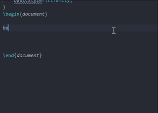
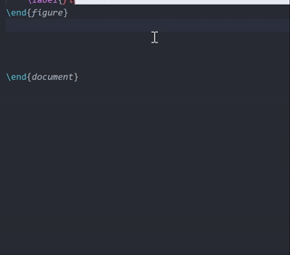

# LaTeX4VSCode(持续更新中)

这里用于存放我在VSCode中使用LaTeX用到的资源。方便自己，也方便大家，欢迎随意取用。如果有想要我新增的资源，可以PR或在讨论区提出。考虑到阅读本仓库的主要是我的同学、朋友，本仓库坚持使用优美的中国话。
- [LaTeX4VSCode(持续更新中)](#latex4vscode持续更新中)
  - [前言](#前言)
  - [入门教程](#入门教程)
    - [建议安装的VSCode扩展](#建议安装的vscode扩展)
    - [墙裂建议下载的软件](#墙裂建议下载的软件)
  - [进阶之路](#进阶之路)
    - [关于VSCode](#关于vscode)
    - [关于LaTeX](#关于latex)
  - [绘图](#绘图)
  - [许可证](#许可证)
    - [TDL](#tdl)

## 前言
关于为什么要在VSCode下使用LaTeX：
1. 支持扩展多。VSC生态很好，用的人多，开发扩展的人也就多了，而且“巨硬”很鼓励开发者分享自己的扩展。有了扩展，就可以把配色调成自己喜欢的样式（将编译器改成适合摸鱼的样式，懂得都懂。
2. 自由度高。如果会玩，自由度高，不会玩就是，“这鬼玩意真难用”。
3. 支持语言多。除了R和MATLAB不太支持，其他我要用的语言都支持得很好，比如Python、Cpp、Markdown。如果所有语言都能用VSC，那就不用记住那么多快捷键了（虽然R Studio和MATLAB的快捷键我都按VSC的改了。
4. 快捷键+自动补全。拯救打字龟速的我。

第四点是最重要的😭那就演示一下所谓的补全是啥吧~

当我要插图片时：

说明：首先，输入snippet中设置好的“prefix”，即自动补全的前缀。根据提示选择需要补全的内容，然后回车确认。输完一个空位之后，tab键即可进入到下一个空位。最后把光标移动到图片名上还可以预览哦~

过分一点，当我要插子图时：

所以，虽然我打字慢，但我写作业还是挺快的。

利益声明：我只有R和MATLAB不在VSC上写，其他语言比如Python、Cpp、Markdown都用VSC写。自动补全和快捷键用得多自然就熟练。
## 入门教程
知乎和CSDN中有很多入门级教程，我这里就不重复造轮子啦。一般使用texlive和SumatraPDF的都可以，比如[这个](https://zhuanlan.zhihu.com/p/166523064)。要注意看原作者是用Mac还是Windows，快捷键可能不一样。

更新：因为某些原因，我造了新的轮子 VSC下的LaTeX使用方法.pdf

### 建议安装的VSCode扩展
* 必选：
  * LaTeX WorkShop：我不知道没有这个怎么在VSC运行LaTeX :-)
* 建议：
  * Better Comments：用于高亮“警告”，“todo”等，对于写作很有帮助（这主要是因为我不喜欢按顺序从头写到尾
  * vscode-icons：让文件夹图案好看一点
  * One Dark Pro：我最喜欢的主题（或者去[VSC官网](https://code.visualstudio.com/docs/getstarted/themes#:~:text=In%20VS%20Code%2C%20open%20the,%3E%20Color%20Theme%20on%20macOS)选一个自己喜欢的主题）
  * Code Spell Checker：无论使用哪种计算机语言我都会用这个来检查我的拼写错误
  * LTex：可以检查文章的语法错误，对我这种英文语法菜鸡帮助挺大的。但是对中文不友好，所以等要写中文的时候就禁用
  * git功能：其实我觉得知道git的玩家不用我提醒VSCode兼容下的git贼好使

### 墙裂建议下载的软件
* Mathpix 用于将图片格式（截图）的公式转换为tex文本

  可以同步手机端和电脑端！可以手（鼠标）写识别！抄作业必备！

  网址：https://mathpix.com/

  我的邀请码：JSncMSsbq5
  
  输入邀请码我和你都能获得50个免费的snip哦~
  
  用过的都说好。这玩意甚至有手机版，可以用手机拍教材，自动同步到电脑上。有时候我会用这个来做文本的OCR，免去打字之苦。

  这个软件功能很多，感兴趣的话可以去[官方doc](https://mathpix.com/docs)看看。看官方doc是一个非常好的习惯！

## 进阶之路
工欲善其事，必先利其器。所谓磨刀不误砍柴工，要想提升写作效率，对编译器和语言的了解都要到位。这里从VSC和TeX两方面简单讲讲。。。。。。。。。。。。。。。。。。。。。。。。。。。。
### 关于VSCode
VSC快捷键在[这](./keyboard-shortcuts/README.md)。目前Windows和MAC快捷键小抄（作弊纸）都已上传，稍后我会出一篇博客专门讲解常用快捷键操作。

自动补全的json文件及使用说明已更新在[这](./snippet/README.md)。

### 关于LaTeX
我这里会放出几个通用模板在template文件夹里，大家各取所需叭~

包括 统计 数学的作业

## 绘图
用python或R或matlab甚至是PPT画好 -> 存为pdf格式 -> 插入图片

大概是我太菜了，我感觉tikz好难用T—T

## 许可证
MIT License

### TDL
* vscode 常用功能 （快捷键及设置）
* 绘图
