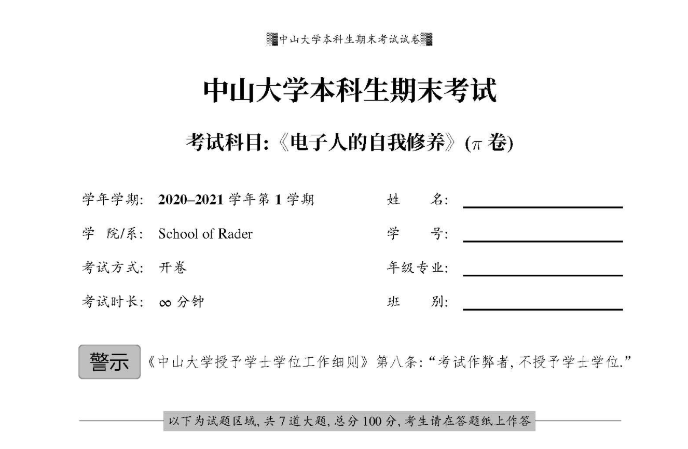

# 模板说明

* 基础：简单的中英文模板 和 普通作业空白模板
* 数学类大作业： 参见 https://github.com/ElegantLaTeX/ElegantPaper 
* 统计平时作业：main示例是一次统计计算的平时作业（其实平时作业用rmd来写也挺方便的，所以我顺手放了一份模板。要注意这个要用RStudio打开哦）
* 数学平时作业：示例是一次运筹学作业，包含tikz绘图
* 中山大学考试卷：https://github.com/WRangers/sysuexam
* 其它模板自己去 https://www.overleaf.com/ 找
* 毕业论文模板：https://github.com/SYSU-SCC/sysu-thesis

中大考试卷复刻非常棒！
